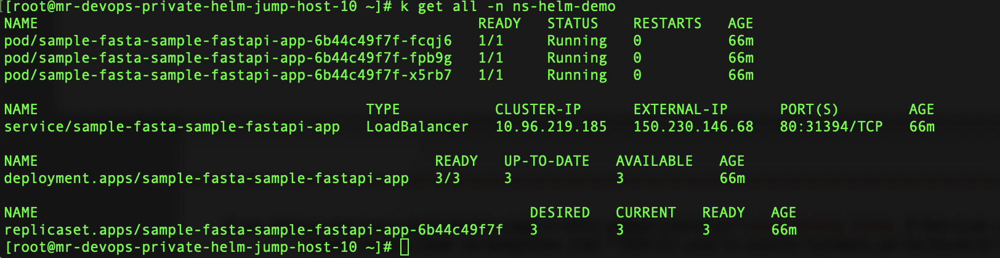
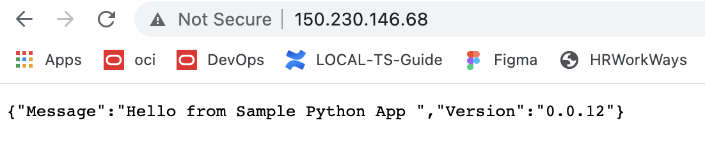

Sample python app made with FASTAPI encomposed with helm chart

---------------------------------------------------

Assumption 

- Valid kubernetes cluster access.
- A possible loadbalancer service type for the kubernetes cluster.

Usage Procedure 


📗  Method 1 : Using as a standalone application.

-----------

```
  $virtualenv dev
  $source dev/bin/activate
  $pip install -r requirements
  $uvicorn main:app --host 0.0.0.0 --port 80
```


📗 Method 2 : Using with helm (as a docker image)

----------


- Build docker image.

```
$ git clone https://github.com/RahulMR42/sample-python-app-with-helm-chart
$ cd  sample-python-app-with-helm-chart
$ docker login <dtr url> (Provide credentials when prompted)
$ docker build -t <dockerurl/sample-python-app:<tag> .
$ docker push <dockerurl/sample-python-app:<tag>
```

- Update the values for helm chart.

```
$ vi helmchart/sample-fastapi-app/values.yaml

```

  -  Update below values 

  ```
  namespace
  image > repository:
  image > tag

  ```    

- Install the helm chart.
- You need to install helm and setup the right kubeconfig for the kubernetes cluster to install


```
$ helm install sample-app helmchart/sample-fastapi-app
$ validate the installation using kubectl get all -n <namespace>
```




- Use the Ladbalancer IP and validate the result (http://loadbalancerIp)




